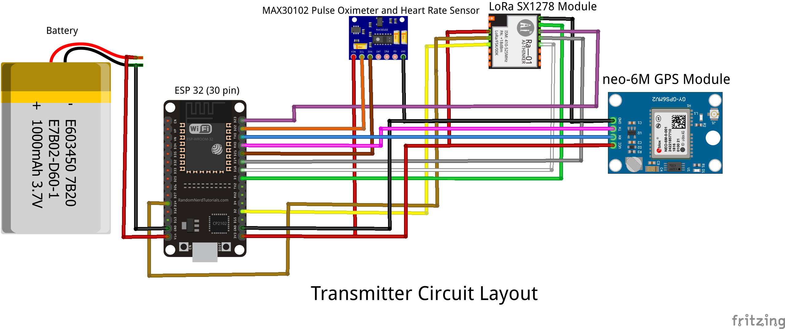
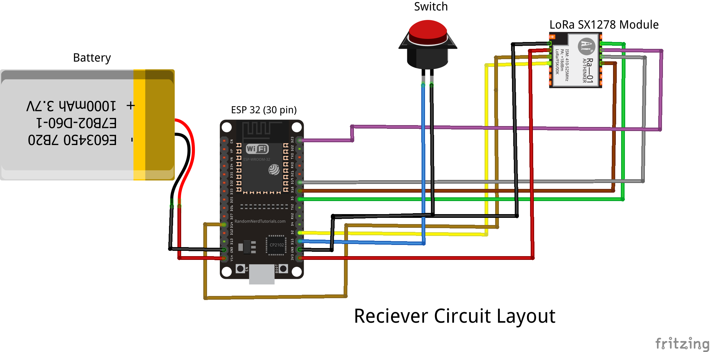

# Health Monitoring and Alert System Using LoRa and ESP32

**Description:**  
This project is designed to monitor and transmit vital signs and location data wirelessly using LoRa communication modules and ESP32 boards. The system includes features for real-time monitoring, alert generation, and data visualization through a web application or Thingspeak.

---

**Hardware Specifications:**  
Below is the hardware required for the project:

1. **Heart Rate Sensor**: Particle sensor MAX30105  
2. **Temperature Sensor**: Particle sensor MAX30105  
3. **GPS Module**: NEO-6M GPS Module  
4. **ESP32 Boards**: ESP32 Thirty Pin  
5. **LoRa Modules**: LoRa SX1278 (Transmitter and Receiver)  
6. **Momentary Switch**

---

**Project Description:**  

### ESP32 Board 1 (Transmitter):  
This board is responsible for collecting and transmitting sensor data.  
Here is the picture of the Transmitter board
  
1. **Connected Components**:  
   - Heart Rate Sensor (MAX30105)  
   - Temperature Sensor (MAX30105)  
   - GPS Module (NEO-6M GPS)  
   - LoRa Transmitter Module  

2. **Activity**:  
   - Collects heart rate and temperature data.  
   - Reads GPS location.  
   - Sends all data wirelessly using the LoRa module to ESP32 Board 2.

---

### ESP32 Board 2 (Receiver):  
This board receives the transmitted data and acts as the system’s hub for alerts and monitoring.  
Here is the picture of the Receiver board
  
1. **Connected Components**:  
   - LoRa Receiver Module (LoRa SX1278)  
   - Momentary Switch  

2. **Activity**:  
   - Receives sensor data and GPS location via LoRa.  
   - Sends data to a database for logging and analysis.  
   - Displays heart rate, temperature, and location on a dashboard.  
   - Triggers an alert if:  
     - Heart rate is below a specified threshold.  
     - The momentary switch is pressed.  
   - Generates an alert with the exact user location in real time.  

---

**Web App Integration:**  
A web application is planned for real-time monitoring and alerts. It provides the following functionalities:  
   - Display live sensor data and GPS location.  
   - Real-time notifications for alerts.  
   - Historical data analysis and visualization.  

Alternatively, **Thingspeak** can be used for monitoring sensor data with email-based alerts. However, for real-time location detection, the web app is preferred over email notifications for efficiency.

---

**Required Libraries:**  
The following libraries are essential for implementing the project:  

1. [SparkFun MAX3010x Pulse and Proximity Sensor Library](https://github.com/sparkfun/SparkFun_MAX3010x_Sensor_Library)  
2. [LoRa Radio Library](https://github.com/sandeepmistry/arduino-LoRa)  
3. [TinyGPS++ Library](https://github.com/mikalhart/TinyGPSPlus)  
4. [ESP_Mail_Client Library](https://github.com/mobizt/ESP-Mail-Client)  

---

**Thingspeak Setup:**  
To use Thingspeak for monitoring:  
1. Create an account at [Thingspeak](https://thingspeak.com/) or sign in.  
2. Create a new channel.  
3. Note the password and Thingspeak API Key for integration.  

---

**SMTP Server Settings:**  
Configure the SMTP settings for sending alerts:  

1. **Gmail SMTP Settings**:  
   - Server: smtp.gmail.com  
   - Username: Your Gmail address  
   - Password: Your Gmail password  
   - Port (TLS): 587  

2. **Outlook SMTP Settings**:  
   - Server: smtp.office365.com  
   - Username: Your Outlook address  
   - Password: Your Outlook password  
   - Port: 587  

3. **Live/Hotmail SMTP Settings**:  
   - Server: smtp.live.com  
   - Username: Your Live/Hotmail address  
   - Password: Your Hotmail password  
   - Port: 587  

Use the corresponding settings for other email providers as needed.

---

**Project Workflow:**  
- [x] Configure ESP32 boards with sensors and modules.  
- [x] Integrate LoRa communication between the transmitter and receiver.  
- [x] Implement data logging and monitoring on a web app or Thingspeak.  
- [x] Generate alerts for abnormal heart rate or button press.  
- [x] Display sensor data and alerts on a dashboard.  
- [x] Provide real-time user location during alerts.

---

 
